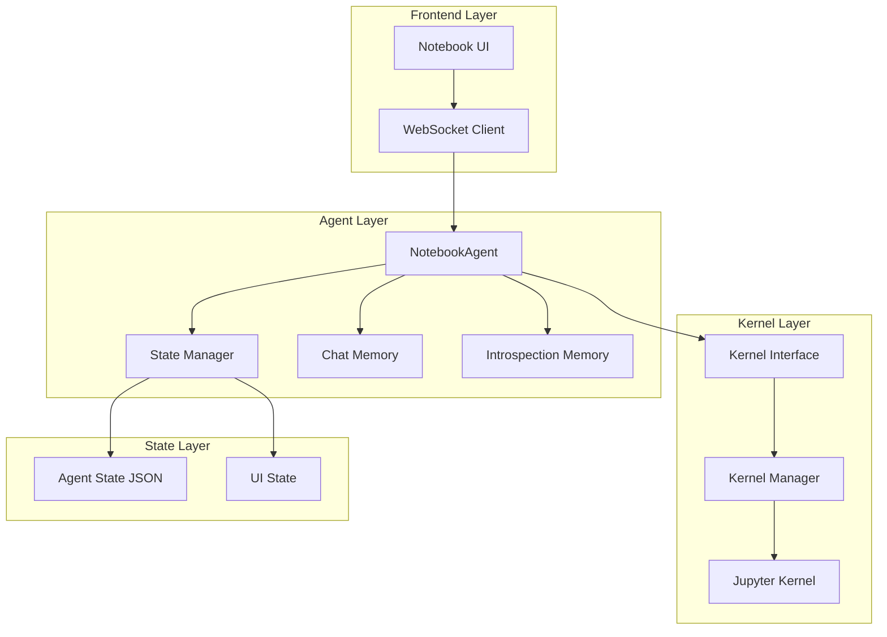
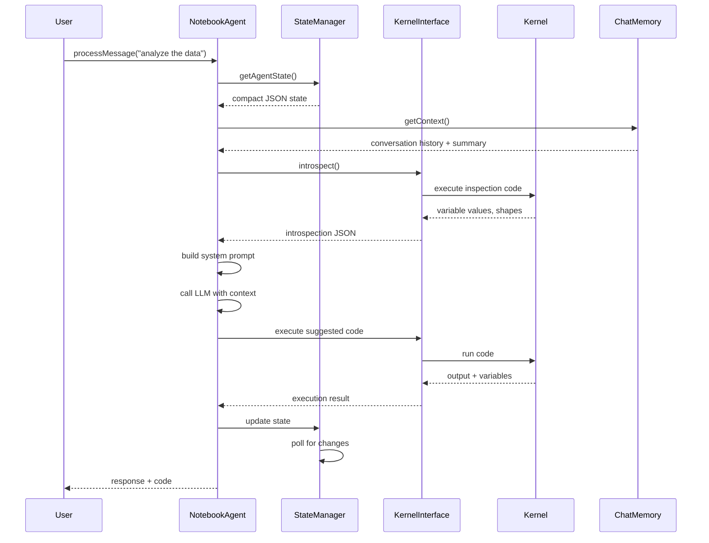

# Design Document: No-RAG Notebook Agent

## Overview

A notebook-based AI agent that operates without traditional RAG infrastructure—no embeddings, no vector databases, no retrieval pipelines. Instead, the agent maintains two complementary memory systems: **In-Context Memory** (introspection data embedded directly in the system prompt) and **Conversation Memory** (rolling summaries for long-running interactions). The agent operates in three modes (ASK, AGENT, PLANNER) and maintains thread-safe state with efficient memory usage suitable for production deployment.

## Architecture



## Components and Interfaces

### NotebookAgent Class

```typescript
interface NotebookAgentConfig {
    notebookId: string;
    mode: AgentMode;
    summaryThreshold: number;  // messages before summary
    introspectionInterval: number;  // ms
    maxContextTokens: number;
    maxSummaryLength: number;
}

type AgentMode = 'ASK' | 'AGENT' | 'PLANNER';

class NotebookAgent {
    private config: NotebookAgentConfig;
    private kernelInterface: KernelInterface;
    private stateManager: StateManager;
    private chatMemory: ChatMemory;
    private introspectionMemory: IntrospectionMemory;
    private currentMode: AgentMode;
    private isRunning: boolean;
    
    constructor(config: NotebookAgentConfig);
    
    // Core lifecycle
    async initialize(): Promise<void>;
    async start(): Promise<void>;
    async stop(): Promise<void>;
    async setMode(mode: AgentMode): Promise<void>;
    
    // Main interaction
    async processMessage(userMessage: string): Promise<AgentResponse>;
    
    // Mode-specific handlers
    private async handleAskMode(message: string): Promise<AgentResponse>;
    private async handleAgentMode(message: string): Promise<AgentResponse>;
    private async handlePlannerMode(message: string): Promise<AgentResponse>;
    
    // Introspection
    async getIntrospectionData(): Promise<IntrospectionJSON>;
    async refreshIntrospection(): Promise<void>;
}
```

### Kernel Interface

```typescript
interface KernelInterfaceConfig {
    notebookId: string;
    executionTimeout: number;
    maxRetries: number;
}

interface ExecutionResult {
    success: boolean;
    output: string;
    error?: string;
    executionTime: number;
    outputs: CellOutput[];
    variables: VariableInfo[];
}

interface VariableInfo {
    name: string;
    type: string;
    shape?: string;
    value: string;
    references: number;
}

interface CellOutput {
    type: 'stream' | 'result' | 'display' | 'error' | 'widget';
    data: any;
    stream?: 'stdout' | 'stderr';
}

class KernelInterface {
    private config: KernelInterfaceConfig;
    private connection: KernelConnection;
    
    constructor(config: KernelInterfaceConfig);
    
    async execute(code: string, options?: ExecutionOptions): Promise<ExecutionResult>;
    async getVariables(): Promise<VariableInfo[]>;
    async getExecutionHistory(): Promise<ExecutionHistoryEntry[]>;
    async interrupt(): Promise<void>;
    async restart(): Promise<void>;
    async introspect(): Promise<IntrospectionJSON>;
}

interface ExecutionOptions {
    timeout?: number;
    captureVariables?: boolean;
    captureHistory?: boolean;
}
```

### State Manager

```typescript
interface AgentState {
    // Compact JSON for Claude system prompt
    version: string;
    timestamp: number;
    notebookId: string;
    mode: AgentMode;
    variables: CompactVariable[];
    executionOrder: string[];
    experimentLog: ExperimentEntry[];
    recentErrors: string[];
    activeCells: string[];
}

interface CompactVariable {
    n: string;      // name
    t: string;      // type
    s?: string;     // shape
    v?: string;     // preview value
    r: number;      // reference count
}

interface ExperimentEntry {
    id: string;
    timestamp: number;
    cellId: string;
    description: string;
    status: 'running' | 'success' | 'error';
}

interface UIState {
    // Rich state for frontend visualization
    kernelStatus: 'idle' | 'busy' | 'error' | 'disconnected';
    variables: RichVariable[];
    executionHistory: ExecutionHistoryEntry[];
    experiments: Experiment[];
    cellStates: Map<string, CellState>;
    chatHistory: ChatMessage[];
    suggestions: string[];
}

interface RichVariable {
    id: string;
    name: string;
    type: string;
    shape: string;
    value: any;
    preview: string;
    dependencies: string[];
    referencedBy: string[];
    createdAt: number;
    updatedAt: number;
}

class StateManager {
    private agentState: AgentState;
    private uiState: UIState;
    private pollingInterval: number;
    private lastUpdate: number;
    private subscribers: Set<StateSubscriber>;
    private lock: Mutex;
    
    constructor(config: StateManagerConfig);
    
    // State updates
    async updateAgentState(updates: Partial<AgentState>): Promise<void>;
    async updateUIState(updates: Partial<UIState>): Promise<void>;
    async syncFromKernel(): Promise<void>;
    
    // Polling
    startPolling(interval?: number): void;
    stopPolling(): void;
    
    // Subscriptions
    subscribe(subscriber: StateSubscriber): () => void;
    getAgentState(): AgentState;
    getUIState(): UIState;
    
    // Serialization
    toSystemPrompt(): string;
    toJSON(): string;
}
```

### Chat Memory with Rolling Summary

```typescript
interface ChatMessage {
    id: string;
    role: 'user' | 'assistant' | 'system';
    content: string;
    timestamp: number;
    tokenCount: number;
    summary?: string;
}

interface ConversationSummary {
    summary: string;
    keyTopics: string[];
    decisions: string[];
    openQuestions: string[];
    lastUpdated: number;
}

class ChatMemory {
    private messages: ChatMessage[];
    private summary: ConversationSummary;
    private config: ChatMemoryConfig;
    private tokenCounter: TokenCounter;
    
    constructor(config: ChatMemoryConfig);
    
    async addMessage(message: ChatMessage): Promise<void>;
    async getContext(): Promise<ChatMessage[]>;
    async getSystemPrompt(): Promise<string>;
    async generateSummary(): Promise<ConversationSummary>;
    async prune(): Promise<void>;
    async getRollingSummary(): Promise<string>;
    
    // Token management
    estimateTokenCount(text: string): number;
    async truncateToLimit(messages: ChatMessage[], maxTokens: number): Promise<ChatMessage[]>;
}
```

### Introspection Memory

```typescript
interface IntrospectionJSON {
    version: string;
    generatedAt: number;
    notebook: {
        id: string;
        cellCount: number;
        executionOrder: string[];
    };
    variables: IntrospectedVariable[];
    experiments: IntrospectedExperiment[];
    executionContext: ExecutionContext;
    recentActivity: ActivityEntry[];
}

interface IntrospectedVariable {
    name: string;
    type: string;
    shape: string;
    valuePreview: string;
    definedIn: string;  // cell ID
    dependencies: string[];
    referencedBy: string[];
}

interface IntrospectedExperiment {
    id: string;
    name: string;
    description: string;
    cells: string[];
    status: 'active' | 'completed' | 'failed';
    metrics: Record<string, number>;
}

interface ExecutionContext {
    currentCell: string | null;
    executionCount: number;
    kernelStatus: string;
    lastExecutionTime: number;
}

interface ActivityEntry {
    timestamp: number;
    type: 'execution' | 'edit' | 'chat';
    description: string;
    cellId?: string;
}

class IntrospectionMemory {
    private data: IntrospectionJSON;
    private kernelInterface: KernelInterface;
    private updateInterval: number;
    private lastUpdate: number;
    
    constructor(kernelInterface: KernelInterface, interval?: number);
    
    async refresh(): Promise<IntrospectionJSON>;
    async getJSON(): Promise<IntrospectionJSON>;
    async toSystemPrompt(): Promise<string>;
    
    // Variable tracking
    async trackVariable(name: string, cellId: string): Promise<void>;
    async untrackVariable(name: string): Promise<void>;
    
    // Experiment tracking
    async startExperiment(name: string, cellIds: string[]): Promise<string>;
    async endExperiment(experimentId: string, status: 'completed' | 'failed'): Promise<void>;
    async logMetric(experimentId: string, key: string, value: number): Promise<void>;
}
```

## Data Flow



## State Structures

### Agent State (Compact JSON for System Prompt)

```json
{
  "version": "1.0",
  "timestamp": 1699012345678,
  "notebookId": "nb-123",
  "mode": "AGENT",
  "variables": [
    {"n": "df", "t": "DataFrame", "s": "(1000, 15)", "v": "df.head()", "r": 5},
    {"n": "model", "t": "RandomForestClassifier", "s": "n_estimators=100", "v": "fitted", "r": 2}
  ],
  "executionOrder": ["cell-1", "cell-2", "cell-3"],
  "experimentLog": [
    {"id": "exp-1", "ts": 1699012300000, "cell": "cell-2", "desc": "baseline model", "status": "success"}
  ],
  "recentErrors": [],
  "activeCells": ["cell-3"]
}
```

### UI State (Rich for Frontend)

```typescript
{
  kernelStatus: 'idle',
  variables: [
    {
      id: 'var-1',
      name: 'df',
      type: 'DataFrame',
      shape: '1000 rows × 15 columns',
      value: <DataFrame object>,
      preview: '   col1  col2  col3\n0     1     2     3\n1     4     5     6',
      dependencies: ['cell-1'],
      referencedBy: ['cell-2', 'cell-3'],
      createdAt: 1699012000000,
      updatedAt: 1699012345000
    }
  ],
  executionHistory: [
    {
      cellId: 'cell-1',
      timestamp: 1699012000000,
      executionTime: 0.5,
      status: 'success',
      output: 'DataFrame loaded'
    }
  ],
  experiments: [
    {
      id: 'exp-1',
      name: 'baseline model',
      description: 'Initial RandomForest with default params',
      cells: ['cell-2'],
      status: 'completed',
      metrics: { accuracy: 0.85, f1: 0.82 }
    }
  ],
  cellStates: {
    'cell-1': { status: 'success', executionCount: 1 },
    'cell-2': { status: 'success', executionCount: 1 },
    'cell-3': { status: 'running', executionCount: 0 }
  },
  chatHistory: [...],
  suggestions: ['Try feature engineering', 'Increase n_estimators']
}
```

## Key Algorithms

### Rolling Summary Algorithm

```typescript
async generateSummary(): Promise<ConversationSummary> {
    const recentMessages = this.messages.slice(-10);
    const allContent = recentMessages.map(m => m.content).join('\n');
    
    // Extract key topics using simple heuristics
    const keyTopics = this.extractTopics(allContent);
    
    // Extract decisions (lines starting with "Decision:" or similar)
    const decisions = this.extractDecisions(allContent);
    
    // Identify open questions (unanswered user queries)
    const openQuestions = this.extractOpenQuestions(recentMessages);
    
    return {
        summary: this.createSummary(recentMessages),
        keyTopics,
        decisions,
        openQuestions,
        lastUpdated: Date.now()
    };
}

async getRollingSummary(): Promise<string> {
    const summary = await this.generateSummary();
    
    return `## Conversation Summary
    
${summary.summary}

### Key Topics
${summary.keyTopics.map(t => `- ${t}`).join('\n')}

### Decisions Made
${summary.decisions.map(d => `- ${d}`).join('\n')}

### Open Questions
${summary.openQuestions.map(q => `- ${q}`).join('\n')}`;
}
```

### State Polling Algorithm

```typescript
private pollingLoop = async () => {
    while (this.isPolling) {
        try {
            const newState = await this.kernelInterface.introspect();
            
            await this.lock.acquire();
            try {
                const hasChanges = this.detectChanges(this.data, newState);
                
                if (hasChanges) {
                    this.data = newState;
                    await this.updateSubscribers('stateChanged', newState);
                }
            } finally {
                this.lock.release();
            }
            
            await this.sleep(this.pollingInterval);
        } catch (error) {
            console.error('Polling error:', error);
            await this.sleep(1000);  // backoff on error
        }
    }
};

private detectChanges(oldState: IntrospectionJSON, newState: IntrospectionJSON): boolean {
    // Check variable changes
    if (oldState.variables.length !== newState.variables.length) return true;
    
    for (const newVar of newState.variables) {
        const oldVar = oldState.variables.find(v => v.name === newVar.name);
        if (!oldVar) return true;
        if (oldVar.valuePreview !== newVar.valuePreview) return true;
        if (oldVar.shape !== newVar.shape) return true;
    }
    
    // Check execution order changes
    if (!arraysEqual(oldState.executionOrder, newState.executionOrder)) return true;
    
    return false;
}
```

### Mode-Specific Processing

```typescript
private async handleAskMode(message: string): Promise<AgentResponse> {
    // Direct question answering with full context
    const context = await this.buildContext();
    const prompt = this.buildAskPrompt(message, context);
    const response = await this.callLLM(prompt);
    
    return {
        type: 'answer',
        content: response.text,
        code: response.code,
        citations: response.citations
    };
}

private async handleAgentMode(message: string): Promise<AgentResponse> {
    // Autonomous agent that can execute code and iterate
    const goal = await this.parseGoal(message);
    const plan = await this.createPlan(goal);
    
    for (const step of plan.steps) {
        const result = await this.executeStep(step);
        if (result.requiresReview) {
            const feedback = await this.getUserFeedback(result);
            if (feedback === 'reject') break;
        }
    }
    
    return { type: 'agent_result', ... };
}

private async handlePlannerMode(message: string): Promise<AgentResponse> {
    // High-level planning without execution
    const context = await this.buildContext();
    const prompt = this.buildPlannerPrompt(message, context);
    const plan = await this.callLLM(prompt);
    
    return {
        type: 'plan',
        content: plan.description,
        steps: plan.steps,
        code: plan.codeSnippets,
        estimatedTime: plan.estimatedTime
    };
}
```

## Error Handling

```typescript
interface AgentError {
    type: 'execution' | 'state' | 'memory' | 'llm' | 'kernel';
    message: string;
    recoverable: boolean;
    context: Record<string, any>;
    timestamp: number;
}

class AgentErrorHandler {
    private errorLog: AgentError[];
    private maxErrors: number;
    
    async handle(error: Error, context: ErrorContext): Promise<ErrorResolution> {
        const agentError = this.categorize(error, context);
        this.errorLog.push(agentError);
        
        if (this.errorLog.length > this.maxErrors) {
            this.errorLog.shift();
        }
        
        switch (agentError.type) {
            case 'execution':
                return this.handleExecutionError(agentError);
            case 'kernel':
                return this.handleKernelError(agentError);
            case 'memory':
                return this.handleMemoryError(agentError);
            default:
                return this.recoverWithRetry(agentError);
        }
    }
    
    private async handleKernelError(error: AgentError): Promise<ErrorResolution> {
        // Attempt kernel restart
        await this.kernelInterface.restart();
        return { action: 'restarted', success: true };
    }
    
    private async handleExecutionError(error: AgentError): Promise<ErrorResolution> {
        // Suggest fix based on error type
        const suggestion = await this.suggestFix(error);
        return { action: 'suggest_fix', suggestion, success: true };
    }
}
```

## Thread Safety

```typescript
class ThreadSafeStateManager {
    private agentState: AgentState;
    private uiState: UIState;
    private agentStateLock: Mutex;
    private uiStateLock: Mutex;
    private subscribers: Map<string, Set<StateSubscriber>>;
    
    async updateAgentState(updates: Partial<AgentState>): Promise<void> {
        await this.agentStateLock.acquire();
        try {
            this.agentState = { ...this.agentState, ...updates };
            this.notifySubscribers('agentState', this.agentState);
        } finally {
            this.agentStateLock.release();
        }
    }
    
    async updateUIState(updates: Partial<UIState>): Promise<void> {
        await this.uiStateLock.acquire();
        try {
            this.uiState = { ...this.uiState, ...updates };
            this.notifySubscribers('uiState', this.uiState);
        } finally {
            this.uiStateLock.release();
        }
    }
    
    async atomicUpdate(
        agentUpdates: Partial<AgentState>,
        uiUpdates: Partial<UIState>
    ): Promise<void> {
        // Acquire both locks in consistent order to prevent deadlock
        await this.agentStateLock.acquire();
        await this.uiStateLock.acquire();
        try {
            Object.assign(this.agentState, agentUpdates);
            Object.assign(this.uiState, uiUpdates);
            this.notifySubscribers('both', { agent: this.agentState, ui: this.uiState });
        } finally {
            this.uiStateLock.release();
            this.agentStateLock.release();
        }
    }
}
```

## Performance Considerations

### Memory Management

```typescript
interface MemoryBudget {
    agentState: number;      // max bytes for agent state JSON
    chatHistory: number;     // max tokens in chat history
    variableCache: number;   // max cached variable values
    outputBuffer: number;    // max output buffer size
}

class MemoryManager {
    private budget: MemoryBudget;
    private currentUsage: MemoryUsage;
    
    async enforceBudget(): Promise<void> {
        const totalUsed = this.calculateTotalUsage();
        
        if (totalUsed > this.budget.agentState) {
            await this.pruneAgentState();
        }
        if (totalUsed > this.budget.chatHistory) {
            await this.pruneChatHistory();
        }
        if (totalUsed > this.budget.variableCache) {
            await this.pruneVariableCache();
        }
    }
    
    private async pruneAgentState(): Promise<void> {
        // Remove old experiments
        const maxExperiments = 10;
        if (this.state.experiments.length > maxExperiments) {
            this.state.experiments = this.state.experiments.slice(-maxExperiments);
        }
        
        // Truncate recent errors
        const maxErrors = 5;
        if (this.state.recentErrors.length > maxErrors) {
            this.state.recentErrors = this.state.recentErrors.slice(-maxErrors);
        }
    }
}
```

### Token Optimization

```typescript
class TokenOptimizer {
    private readonly RESERVED_TOKENS = 1000;  // reserved for response
    private readonly OVERHEAD_ESTIMATE = 50;   // JSON formatting overhead
    
    async optimizeForContext(
        messages: ChatMessage[],
        introspection: IntrospectionJSON,
        maxTokens: number
    ): Promise<OptimizedContext> {
        const available = maxTokens - this.RESERVED_TOKENS - this.OVERHEAD_ESTIMATE;
        
        // Estimate token counts
        const messageTokens = messages.map(m => this.countTokens(m.content));
        const introspectionTokens = this.countTokens(JSON.stringify(introspection));
        
        // Allocate tokens
        const introspectionBudget = Math.min(
            introspectionTokens,
            Math.floor(available * 0.3)  // 30% for introspection
        );
        const messageBudget = available - introspectionBudget;
        
        // Truncate as needed
        const truncatedMessages = await this.truncateMessages(
            messages,
            messageBudget
        );
        const truncatedIntrospection = await this.truncateIntrospection(
            introspection,
            introspectionBudget
        );
        
        return {
            messages: truncatedMessages,
            introspection: truncatedIntrospection,
            totalTokens: this.countTokens(JSON.stringify(truncatedMessages)) +
                        this.countTokens(JSON.stringify(truncatedIntrospection))
        };
    }
}
```

## Security Considerations

- **System Prompt Injection**: Validate and sanitize all introspection data before embedding in system prompt
- **Variable Access Control**: Restrict access to sensitive variables based on user permissions
- **Code Execution Safety**: Implement sandboxing and timeout for all kernel executions
- **State Isolation**: Ensure agent state is isolated per notebook/user

## Dependencies

- Jupyter Kernel (IPython or compatible)
- WebSocket server for real-time communication
- LLM API client (OpenAI/Anthropic compatible)
- Mutex library for thread safety
- Token counting library