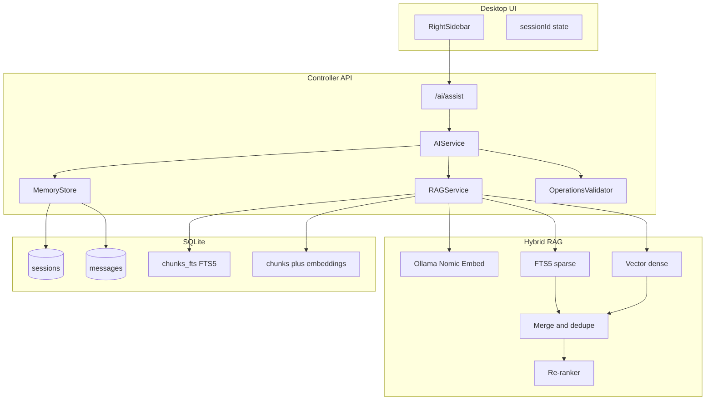

# RAG + SQLite Agent Memory Architecture (Revised)

## Overview

- **Conversation memory:** Session-scoped history in SQLite; loaded when building the prompt.
- **Hybrid RAG:** Sparse (SQLite FTS5) + dense (Nomic embeddings via Ollama); merge, dedupe, then **re-rank** before injecting into context.
- **Strict operations schema:** Every LLM response that contains operations is validated (Zod) so the UI always receives a valid, schema-compliant list for creating/editing cells—even with small models.

---

## 1. Target architecture



---

## 2. Strict operations schema (cell-creation reliability)

**Goal:** Response format for operations is strictly maintained so even small models produce valid, parseable operations.

### 2.1 Canonical schema (Zod)

- **New file:** `apps/controller-node/src/core/ai/operationsSchema.ts`
- Discriminated union per operation type:

| Type | params |
|------|--------|
| `add_cell` | `{ type: "code" \| "markdown", content: string }` |
| `edit_cell` | `{ cellIndex: number, content: string, type?: "code" \| "markdown" }` |
| `delete_cell` | `{ cellIndex: number }` |
| `create_notebook` | `{ name: string }` |
| `add_package` | `{ packages: string[] }` (error-fix) |

- Export: `OperationSchema`, `OperationsArraySchema`, and a validator returning `{ success: true, data }` or `{ success: false, errors }`.

### 2.2 Validation and repair in AIService

- After `extractOperations(rawText)`:
  1. Run each item through Zod `safeParse`.
  2. Keep only operations that pass; log or drop invalid ones.
  3. Optional: if the model returned something that looks like operations but **zero** pass validation, **one retry** with a short “fix the JSON to match the operations schema” prompt, then re-parse and re-validate.
- Return only the validated list so the UI contract is always a schema-compliant array.

### 2.3 Prompt tightening (prompts.ts)

- Add a **compact JSON schema** block mirroring the Zod schema (exact field names and types).
- Emphasize: “Output exactly this structure. No extra fields. Only these operation types.”
- Add **few-shot examples** with correct escaping (`\\n` in content).
- Add: “Operations MUST appear in a single \`\`\`operations\`\`\` block as a JSON array; no other JSON.”

---

## 3. SQLite schema (memory + hybrid RAG)

- **DB path:** `apps/controller-node/data/agent_memory.db` (config: `dataDir` in config.ts).

### 3.1 Conversation memory

```sql
CREATE TABLE sessions (
  id TEXT PRIMARY KEY,
  notebook_name TEXT,
  created_at INTEGER NOT NULL,
  last_activity_at INTEGER NOT NULL
);

CREATE TABLE messages (
  id INTEGER PRIMARY KEY AUTOINCREMENT,
  session_id TEXT NOT NULL REFERENCES sessions(id),
  role TEXT NOT NULL CHECK (role IN ('user', 'assistant', 'system')),
  content TEXT NOT NULL,
  token_estimate INTEGER,
  created_at INTEGER NOT NULL
);

CREATE INDEX idx_messages_session_created ON messages(session_id, created_at DESC);
CREATE INDEX idx_sessions_last_activity ON sessions(last_activity_at);
```

### 3.2 RAG chunks (FTS5 + vector)

```sql
CREATE TABLE chunks (
  id INTEGER PRIMARY KEY AUTOINCREMENT,
  session_id TEXT NOT NULL,
  source TEXT NOT NULL,  -- 'message' | 'cell' | 'attachment'
  content TEXT NOT NULL,
  embedding BLOB,       -- Nomic vector; e.g. 768 * 4 bytes float32
  created_at INTEGER NOT NULL,
  FOREIGN KEY (session_id) REFERENCES sessions(id)
);

CREATE VIRTUAL TABLE chunks_fts USING fts5(content, session_id, content='chunks', content_rowid='id');
-- Triggers to keep chunks_fts in sync with chunks (INSERT/UPDATE/DELETE)
```

- Similarity: compute cosine in Node after fetching chunk embeddings for the session, or use sqlite-vec if desired.

---

## 4. Embedding model: Nomic via Ollama

- **Model:** `nomic-embed-text` (Ollama).
- **API:** `POST {OLLAMA_BASE_URL}/api/embeddings` with `{ "model": "nomic-embed-text", "prompt": "text" }`. Use task type `search_document` for indexing chunks, `search_query` for the user query (if supported in your Ollama version).
- **New module:** `apps/controller-node/src/core/ai/embeddings.ts` — `embed(text: string)` and `embedMany(texts: string[])` with concurrency limit for batch.
- Reuse Ollama base URL from env (e.g. `OLLAMA_BASE_URL` or provider config).

---

## 5. Hybrid RAG pipeline

- **New file:** `apps/controller-node/src/core/ai/RAGService.ts`

### 5.1 Indexing

- When a message is persisted: optionally chunk long content, insert into `chunks`, run FTS triggers, embed with Nomic `search_document`, store `embedding` in `chunks`.
- Optionally index notebook cell content with `source = 'cell'` for the current session.

### 5.2 Retrieval (per request)

- **Sparse:** FTS5 search on `chunks_fts` for session (and optionally global); top-N (e.g. 15).
- **Dense:** Embed query with Nomic `search_query`; fetch session chunk embeddings; cosine similarity in Node; top-N (e.g. 15).
- **Merge:** Combine by chunk id; reciprocal rank fusion or weighted sum; dedupe; keep top-K (e.g. 20).

### 5.3 Re-ranking

- **Re-ranker:** Re-rank merged top-K for relevance. Options:
  - Cross-encoder or small re-rank model (Ollama or API).
  - LLM-based: “Given query and passages, return passage IDs in relevance order.”
  - Heuristic: combine FTS rank + vector score.
- **Output:** Top-M (e.g. 5–8) re-ranked chunks to inject as “Retrieved context” in the system or a dedicated context message.

### 5.4 Injection

- In `AIService.generate()`, before building messages: `RAGService.retrieve(sessionId, query, { topK: 20, afterRerank: 8 })`, then prepend retrieved chunks to context.

---

## 6. Memory store (MemoryStore.ts)

- **getOrCreateSession(sessionId?, notebookName?)**
- **appendMessage(sessionId, role, content, tokenEstimate?)**
- **getRecentMessages(sessionId, { limit, maxTokens })** — order by `created_at ASC` for conversation order.
- **Cleanup:** Delete old sessions (TTL), trim messages per session, optional VACUUM. Optionally delete chunks for removed sessions.

---

## 7. Conversation flow in AIService (with RAG and validation)

1. **Session:** `MemoryStore.getOrCreateSession(sessionId, context?.notebookName)`.
2. **History:** `MemoryStore.getRecentMessages(sessionId, { limit, maxTokens })`.
3. **RAG:** `RAGService.retrieve(sessionId, query, options)` → re-ranked chunks.
4. **Build messages:** `[SystemMessage(system + RAG context), ...history, HumanMessage(notebookContext + prompt)]`.
5. **Invoke LLM** → raw response.
6. **Extract + validate:** `extractOperations(rawText)` then Zod-validate each; keep only valid ops; optional one retry if zero valid.
7. **Persist:** `MemoryStore.appendMessage` for user and assistant; optionally trigger chunk indexing.
8. **Return:** `{ text, operations, tokenInfo, sessionId }` — `operations` always schema-valid.

---

## 8. Memory cleanup

- Per-session message cap (e.g. last 50); session TTL (e.g. 7 days); periodic VACUUM; delete chunks for deleted sessions.

---

## 9. API and UI changes

- Request: optional `sessionId`. Response: always `sessionId`. UI: hold `sessionId`, send in `askAI`, set from response; “New chat” clears it.

---

## 10. Files to add or touch

| Area | Action |
|------|--------|
| **controller-node** | Add `better-sqlite3`; use existing `zod` |
| **config** | Add `dataDir`; reuse or add Ollama base URL for embeddings |
| **New** | `operationsSchema.ts` — Zod schemas and validator for all operation types |
| **New** | `MemoryStore.ts` — SQLite sessions, messages, cleanup; optional chunk hook |
| **New** | `embeddings.ts` — Ollama nomic-embed-text client |
| **New** | `RAGService.ts` — Hybrid retrieval (FTS5 + vector), merge, re-rank; chunk indexing |
| **New** | Optional: `cleanup.ts` or scheduled cleanup in MemoryStore |
| **AIService.ts** | MemoryStore + RAGService; validate operations with schema; optional retry; return only valid ops |
| **prompts.ts** | Compact JSON schema + few-shot; stress strict operations format |
| **routes/ai.ts** | Optional `sessionId`; return `sessionId` |
| **desktop-ui** | `sessionId` in state and in `AIRequest`; “New chat” clears session |

---

## 11. Error handling

- **Ollama / nomic-embed-text down:** RAG degrades to history-only (skip dense/FTS or both); log and continue.
- **Invalid operations:** Return only valid ops; if none, return empty array; optionally mention in `text`.
- **DB / FTS / embedding write failures:** Log; do not fail the whole request (skip RAG or indexing for that turn).
